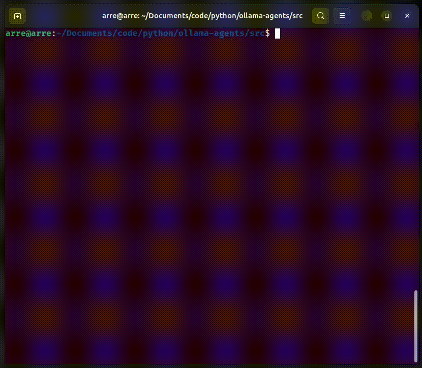

# ollama-agents


<div style="text-align: center; font-size: 150%; font-weight: bold;">
Agentic framework implemented exclusively around Ollama models.
</div>


The **core philosophy** of this agentic framework is to provide a simple and easy-to-use interface for building agents. It is built on top of the `ollama-python` SDK and provides a high-level API for building agents.

The core design can be compared to vehicles (cars, boats, airplanes, etc.) where the `LLM` is the engine powering the AI application, `Agent` is the vehicle body acting as the skeleton, `tools` are the accessories allowing the agent to perform external actions, and `system_prompt` is the travel destination guiding the agent to the goal.

- You want an agent that can dynamically execute python code for dynamic tasks in scenarios where it is hard to define specific python functions? then `CodingAgent` is perfect.
- You want an agent that can *read*, *write* and *edit* files? then `WritingAgent` comes prebuilt with all the necessary I/O tools.
- You have some set of python functions that you would want to add to your language model to perform external actions? then `ReActAgent` takes your list of tools and takes care of the internal tool calling process for you.

The prebuilt agents inside `prebuilt_agents.py` are perfect for plug and play situations, and if you want more customization, then `Agent` offers a more advanced interface with features as shown in the [Custom Agent](#custom-agent-advanced-user) example.

## Quick demo
Executing `main.py` in the terminal with `verbose=True` will show the internal thought process of the agent. Here is a quick demo of a custom *weather agent*.



## 🚀 Quickstart

### Prebuilt Agent (Plug and play)

```python
from llms import LLM
from prebuilt_agents import CodingAgent

# Initialize the LLM
llm = LLM("qwen3:4b")

# Initialize the prebuilt agent
coding_agent = CodingAgent(llm, verbose=True)

# Invoke the agent
output = coding_agent.invoke("Convert the 35 degrees celsius to fahrenheit.")

print(output)
# >>> 35 degrees Celsius is equivalent to 95 degrees Fahrenheit.
```

### Custom Agent (Advanced user)
Advanced example demonstrating more features of the framework.

```python
import random
from llm import LLM
from agents import Agent
from pydantic import BaseModel, Field

def main():

    # Pydantic class for structured output
    class Weather(BaseModel):
        temperature_fahrenheit: float = Field(description="Temperature in Fahrenheit")
        weather_condition: str = Field(description="Description of the weather")
        appropriate_clothing: str = Field(description="Appropriate clothing for the weather")

    # Tools
    def celcius_to_fahrenheit(celcius: float) -> float:
        """Convert Celsius to Fahrenheit."""
        return (celcius * 9/5) + 32

    def weather_condition(city_name: str) -> str:
        """Get the weather condition for a given city."""
        return random.choice(["Sunny", "Rainy", "Cloudy", "Windy", "Snowy"])
    

    # Sampling parameters
    sampling_params = {
        "temperature": 0.5,
        "top_p": 0.9,
        "top_k": 100,
    }

    # Initialize the LLM
    llm = LLM(
        model_name="qwen3:4b", # Model name as given by running `ollama list` in bash
        use_thinking=True, # Enable thinking/reasoning mode for supported models
        options=sampling_params, # Custom sampling parameters
    )

    # Initialize the Agent
    agent = Agent(
        agent_name="Weather Agent", # Agent name
        llm=llm, # The LLM instance
        tools=[celcius_to_fahrenheit, weather_condition], # List of tools
        system_prompt="You are a helpful assistant.", # System prompt
        structured_output=Weather, # Structured output
        n_max_steps=5, # Limit the number of steps
    )

    # Invoke the agent
    output = agent.invoke("It is 35 degrees celsius in New York. What is the weather condition?")

    print(output)
    # >>> temperature_fahrenheit=95.0 weather_condition='Windy' appropriate_clothing='Light jacket or windbreaker'
    

if __name__ == "__main__":
    main()
```


## 🛠️ Getting Started

### Prerequisites

- Python 3.12 or higher
- ollama (see [installation instructions](#installing-ollama))

### Installation
Setup and installation using `uv`:

Install dependencies:
```bash
uv sync
```

Activate the virtual environment:
```bash
source .venv/bin/activate
```


### Installing Ollama

1. Visit the [Ollama website](https://ollama.com/) and follow the installation instructions for your operating system.

2. Once installed, download a local model (e.g., qwen3:4b):
   ```bash
   ollama pull qwen3:4b
   ```

3. Run the model in your terminal:
   ```bash
   ollama run qwen3:4b
   ```


## 📜 License
This repository is licensed under the MIT License - see the [LICENSE](LICENSE) file for details.

## Roadmap

The core agentic framework features are implemented. Future plans and roadmap goals are defined in the [Roadmap](roadmap.md).


